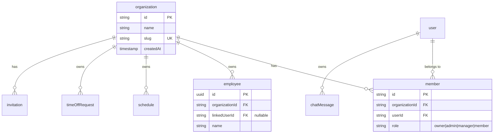

# Organization-Based Multi-Tenancy Migration

**Type:** Architecture Enhancement
**Priority:** High
**Complexity:** Large (touches entire application)
**Created:** 2026-01-31

---

## Overview

Transform the application from single-user data isolation to organization-based multi-tenancy. Currently, each user owns their own isolated data (employees, schedules, time-off requests). The new model introduces organizations that own data, with multiple users belonging to an organization with role-based access.

```
Current Model (Single-User Isolation):
user --owns--> employees
user --owns--> schedules
user --owns--> time_off_requests

Each user has their own isolated data. Sarah's employees are invisible to Sam.

New Model (Organization-Based):
organization --has--> employees
organization --has--> schedules
organization --has--> members (users with roles: owner, admin, manager, member)

All users in an organization see the same employees and schedules.
```

### Context: Internal Tool with Domain Restrictions

**This is an internal tool** with the following characteristics:
- **Currently restricted** to `@campminder.com` Google accounts only
- **Future expansion** to include `@ultracamp.com` as a separate organization
- **Domain-based auto-assignment** - users auto-join their company's org on signup
- **Full RBAC** - managers, team members, and admins have different permissions
- **Proper security** - role checks on all operations

**What this means:**
- Users auto-join the correct org based on email domain (no manual invites for initial join)
- Admins/owners can still invite users, manage roles, and remove members
- Full role-based permissions remain intact

---

## Problem Statement

The current architecture makes it impossible for multiple managers to collaborate on scheduling:

1. **Data Isolation**: Each user's employees, schedules, and time-off requests are completely isolated
2. **No Team Collaboration**: Sarah cannot see or edit schedules that Sam created
3. **No Role-Based Access**: Everyone with access is effectively a full admin of their own silo
4. **AI Context Limited**: AI assistant only knows about one user's data

### Business Impact

- Cannot onboard multiple managers for the same team
- No delegation or backup coverage for scheduling duties
- Cannot have "viewer" roles for supervisors or employees
- Each manager has to recreate employee lists independently

---

## Proposed Solution

Implement Better Auth's organization plugin with:
- Custom roles (owner, admin, manager, member)
- Domain-based auto-assignment on signup
- Full permission checks on all operations
- Proper member management for admins

### Architecture Changes



### Role Hierarchy

| Role | Description | Permissions |
|------|-------------|-------------|
| **owner** | Organization creator/owner | Full access, can delete org, transfer ownership, manage all members |
| **admin** | Full administrative access | Everything except delete org; can manage members |
| **manager** | Scheduling operations | Create/edit schedules, manage employees, approve time-off, view reports |
| **member** | Read-only + self-service | View schedules, submit own time-off requests |

---

## Technical Approach

### Phase 1: Schema & Auth Foundation

**Goal:** Add organization tables and configure Better Auth organization plugin

#### 1.1 Organization Configuration

Create `src/lib/organizations.ts` for domain-to-org mapping:

```typescript
// Domain configuration for auto-assignment
export const ORGANIZATION_DOMAINS = {
  campminder: {
    id: "org_campminder",
    name: "CampMinder",
    slug: "campminder",
    domains: ["campminder.com"],
  },
  ultracamp: {
    id: "org_ultracamp",
    name: "UltraCamp",
    slug: "ultracamp",
    domains: ["ultracamp.com"],
  },
} as const;

/**
 * Get organization config from email domain
 * Returns null if domain is not allowed
 */
export function getOrganizationByDomain(email: string) {
  const domain = email.split("@")[1]?.toLowerCase();

  for (const org of Object.values(ORGANIZATION_DOMAINS)) {
    if (org.domains.includes(domain)) {
      return org;
    }
  }
  return null;
}

/**
 * Check if email domain is allowed to sign up
 */
export function isAllowedDomain(email: string): boolean {
  return getOrganizationByDomain(email) !== null;
}

/**
 * Get all allowed email domains
 */
export function getAllowedDomains(): string[] {
  return Object.values(ORGANIZATION_DOMAINS).flatMap(org => org.domains);
}
```

#### 1.2 Database Schema Changes

Add organization tables to `src/lib/schema.ts` (Better Auth managed):

```typescript
// Organization table (Better Auth managed)
export const organization = pgTable("organization", {
  id: text("id").primaryKey(),
  name: text("name").notNull(),
  slug: text("slug").notNull().unique(),
  logo: text("logo"),
  metadata: text("metadata"),
  createdAt: timestamp("createdAt").notNull().defaultNow(),
});

// Member table (Better Auth managed)
export const member = pgTable("member", {
  id: text("id").primaryKey(),
  organizationId: text("organizationId")
    .notNull()
    .references(() => organization.id, { onDelete: "cascade" }),
  userId: text("userId")
    .notNull()
    .references(() => user.id, { onDelete: "cascade" }),
  role: text("role").notNull(),
  createdAt: timestamp("createdAt").notNull().defaultNow(),
}, (table) => [
  index("member_org_idx").on(table.organizationId),
  index("member_user_idx").on(table.userId),
]);

// Invitation table (Better Auth managed)
export const invitation = pgTable("invitation", {
  id: text("id").primaryKey(),
  organizationId: text("organizationId")
    .notNull()
    .references(() => organization.id, { onDelete: "cascade" }),
  email: text("email").notNull(),
  role: text("role").notNull(),
  status: text("status").notNull().default("pending"),
  expiresAt: timestamp("expiresAt").notNull(),
  inviterId: text("inviterId").notNull().references(() => user.id),
  createdAt: timestamp("createdAt").notNull().defaultNow(),
}, (table) => [
  index("invitation_org_idx").on(table.organizationId),
]);
```

Add `organizationId` to tenant-scoped tables (10 total):

| Table | Change | Index |
|-------|--------|-------|
| `employee` | Add `organizationId` (NOT NULL after migration) | `employee_org_idx` |
| `schedule` | Add `organizationId` (NOT NULL after migration) | `schedule_org_idx` |
| `shift` | Add `organizationId` (for query efficiency) | `shift_org_idx` |
| `timeOffRequest` | Add `organizationId` (NOT NULL after migration) | `timeoff_org_idx` |
| `employeePreference` | Add `organizationId` (NOT NULL after migration) | - |
| `fairnessMetric` | Add `organizationId` (NOT NULL after migration) | - |
| `schedulingConstraint` | Add `organizationId` (NOT NULL after migration) | - |
| `ptoBalance` | Add `organizationId` (NOT NULL after migration) | - |
| `scheduleAuditLog` | Add `organizationId` (nullable for historical) | - |
| `ruleOverride` | Add `organizationId` (nullable for historical) | - |

**Note:** `chatMessage` remains user-scoped (personal conversation history).

#### 1.3 Permissions Configuration

Create `src/lib/permissions.ts`:

```typescript
import { createAccessControl } from "better-auth/plugins/access";

export const statement = {
  // Organization management
  organization: ["update", "delete"],
  member: ["create", "update", "delete"],
  invitation: ["create", "cancel"],

  // Application-specific permissions
  schedule: ["create", "read", "update", "delete", "publish"],
  employee: ["create", "read", "update", "delete"],
  timeOff: ["create", "read", "approve", "deny"],
  reports: ["read", "export"],
} as const;

export const ac = createAccessControl(statement);

// Owner: Full access including org deletion
export const owner = ac.newRole({
  organization: ["update", "delete"],
  member: ["create", "update", "delete"],
  invitation: ["create", "cancel"],
  schedule: ["create", "read", "update", "delete", "publish"],
  employee: ["create", "read", "update", "delete"],
  timeOff: ["create", "read", "approve", "deny"],
  reports: ["read", "export"],
});

// Admin: Everything except org deletion
export const admin = ac.newRole({
  organization: ["update"],
  member: ["create", "update", "delete"],
  invitation: ["create", "cancel"],
  schedule: ["create", "read", "update", "delete", "publish"],
  employee: ["create", "read", "update", "delete"],
  timeOff: ["create", "read", "approve", "deny"],
  reports: ["read", "export"],
});

// Manager: Scheduling operations, no member management
export const manager = ac.newRole({
  schedule: ["create", "read", "update", "publish"],
  employee: ["create", "read", "update"],
  timeOff: ["create", "read", "approve", "deny"],
  reports: ["read"],
});

// Member: Read-only + own time-off
export const member = ac.newRole({
  schedule: ["read"],
  employee: ["read"],
  timeOff: ["create", "read"], // Can only create own requests
  reports: ["read"],
});
```

#### 1.4 Better Auth Configuration

Update `src/lib/auth.ts`:

```typescript
import { betterAuth } from "better-auth";
import { drizzleAdapter } from "better-auth/adapters/drizzle";
import { organization } from "better-auth/plugins";
import { APIError } from "better-auth/api";
import { db } from "./db";
import { ac, owner, admin, manager, member } from "./permissions";
import { getOrganizationByDomain, getAllowedDomains } from "./organizations";

export const auth = betterAuth({
  database: drizzleAdapter(db, {
    provider: "pg",
  }),

  user: {
    additionalFields: {
      role: {
        type: "string",
        defaultValue: "team_member",
      },
      isSchedulable: {
        type: "boolean",
        defaultValue: true,
      },
    },
  },

  socialProviders: {
    google: {
      clientId: process.env.GOOGLE_CLIENT_ID as string,
      clientSecret: process.env.GOOGLE_CLIENT_SECRET as string,
    },
  },

  plugins: [
    organization({
      ac,
      roles: { owner, admin, manager, member },

      // Disable user-created orgs (orgs are pre-provisioned)
      allowUserToCreateOrganization: false,

      // Optional: Configure invitation emails
      async sendInvitationEmail(data) {
        // Implement if you want email invitations
        // For internal tool, may not be needed
      },
    }),
  ],

  // Domain validation and auto-organization assignment
  databaseHooks: {
    user: {
      create: {
        before: async (user) => {
          // Validate email domain
          const orgConfig = getOrganizationByDomain(user.email);

          if (!orgConfig) {
            throw new APIError("FORBIDDEN", {
              message: `Access restricted to ${getAllowedDomains().join(", ")} email addresses only.`,
            });
          }

          return { data: user };
        },

        after: async (user) => {
          // Auto-assign user to organization based on email domain
          const orgConfig = getOrganizationByDomain(user.email);

          if (orgConfig) {
            // Ensure organization exists
            const existingOrg = await db.query.organization.findFirst({
              where: eq(organization.id, orgConfig.id),
            });

            if (!existingOrg) {
              // Create org if it doesn't exist (first user from this domain)
              await db.insert(organization).values({
                id: orgConfig.id,
                name: orgConfig.name,
                slug: orgConfig.slug,
              });
            }

            // Add user as member (manager role by default for new users)
            await db.insert(member).values({
              id: nanoid(),
              organizationId: orgConfig.id,
              userId: user.id,
              role: "manager", // Default role - admins can change later
            });
          }
        },
      },
    },
  },
});
```

Update `src/lib/auth-client.ts`:

```typescript
import { createAuthClient } from "better-auth/react";
import { organizationClient } from "better-auth/client/plugins";
import { ac, owner, admin, manager, member } from "./permissions";

export const authClient = createAuthClient({
  baseURL: process.env.NEXT_PUBLIC_APP_URL || "http://localhost:3000",
  plugins: [
    organizationClient({
      ac,
      roles: { owner, admin, manager, member },
    }),
  ],
});

export const {
  signIn,
  signOut,
  signUp,
  useSession,
  getSession,
  useActiveOrganization,
  useListOrganizations,
} = authClient;
```

**Deliverables:**
- [ ] Organization domain config created (`src/lib/organizations.ts`)
- [ ] Permissions file created (`src/lib/permissions.ts`)
- [ ] Schema updated with organization tables
- [ ] Schema updated with organizationId on 10 data tables
- [ ] Better Auth configured with organization plugin
- [ ] Better Auth configured with domain validation hook
- [ ] Auth client configured with organizationClient plugin
- [ ] Run `npm run db:push` to apply schema changes

---

### Phase 2: Data Migration

**Goal:** Migrate existing user data to CampMinder organization

#### 2.1 Migration Script

Create `scripts/migrate-to-organizations.ts`:

```typescript
import { db } from "@/lib/db";
import {
  user, organization, member, employee, schedule, shift,
  timeOffRequest, employeePreference, fairnessMetric,
  schedulingConstraint, ptoBalance, scheduleAuditLog, ruleOverride
} from "@/lib/schema";
import { eq, sql, isNull } from "drizzle-orm";
import { nanoid } from "nanoid";
import { ORGANIZATION_DOMAINS } from "@/lib/organizations";

async function migrateToOrganizations() {
  console.log("Starting organization migration...");

  // 1. Create the CampMinder organization
  const campminderOrg = ORGANIZATION_DOMAINS.campminder;

  await db.insert(organization).values({
    id: campminderOrg.id,
    name: campminderOrg.name,
    slug: campminderOrg.slug,
  }).onConflictDoNothing();

  console.log(`Created/verified organization: ${campminderOrg.name}`);

  // 2. Get all existing users
  const existingUsers = await db.select().from(user);
  console.log(`Found ${existingUsers.length} users to migrate`);

  // 3. Add each user as a member of CampMinder org
  for (const u of existingUsers) {
    // Check if already a member
    const existingMember = await db.query.member.findFirst({
      where: and(
        eq(member.userId, u.id),
        eq(member.organizationId, campminderOrg.id)
      ),
    });

    if (!existingMember) {
      // Determine role based on existing user.role
      const memberRole = u.role === "manager" ? "manager" : "member";

      await db.insert(member).values({
        id: nanoid(),
        organizationId: campminderOrg.id,
        userId: u.id,
        role: memberRole,
      });
      console.log(`Added ${u.email} as ${memberRole}`);
    }
  }

  // 4. Update all data tables with organizationId
  const tables = [
    { table: employee, name: "employee" },
    { table: schedule, name: "schedule" },
    { table: timeOffRequest, name: "timeOffRequest" },
    { table: employeePreference, name: "employeePreference" },
    { table: fairnessMetric, name: "fairnessMetric" },
    { table: schedulingConstraint, name: "schedulingConstraint" },
    { table: ptoBalance, name: "ptoBalance" },
  ];

  for (const { table, name } of tables) {
    await db
      .update(table)
      .set({ organizationId: campminderOrg.id })
      .where(isNull(table.organizationId));
    console.log(`Updated ${name} table`);
  }

  // 5. Update shift table
  await db.execute(sql`
    UPDATE shift
    SET "organizationId" = ${campminderOrg.id}
    WHERE "organizationId" IS NULL
  `);
  console.log("Updated shift table");

  // 6. Update audit tables
  await db.execute(sql`
    UPDATE schedule_audit_log
    SET "organizationId" = ${campminderOrg.id}
    WHERE "organizationId" IS NULL
  `);
  await db.execute(sql`
    UPDATE rule_override
    SET "organizationId" = ${campminderOrg.id}
    WHERE "organizationId" IS NULL
  `);
  console.log("Updated audit tables");

  // 7. Add NOT NULL constraints
  await db.execute(sql`
    ALTER TABLE employee ALTER COLUMN "organizationId" SET NOT NULL;
    ALTER TABLE schedule ALTER COLUMN "organizationId" SET NOT NULL;
    ALTER TABLE shift ALTER COLUMN "organizationId" SET NOT NULL;
    ALTER TABLE time_off_request ALTER COLUMN "organizationId" SET NOT NULL;
    ALTER TABLE employee_preference ALTER COLUMN "organizationId" SET NOT NULL;
    ALTER TABLE fairness_metric ALTER COLUMN "organizationId" SET NOT NULL;
    ALTER TABLE scheduling_constraint ALTER COLUMN "organizationId" SET NOT NULL;
    ALTER TABLE pto_balance ALTER COLUMN "organizationId" SET NOT NULL;
  `);
  console.log("Added NOT NULL constraints");

  console.log("Migration complete!");
}

migrateToOrganizations().catch(console.error);
```

**Deliverables:**
- [ ] Migration script created and tested locally
- [ ] Migration run (all existing data → CampMinder org)
- [ ] All existing users added as members with appropriate roles

---

### Phase 3: API Route Updates

**Goal:** Update all API routes to use organizationId with permission checks

#### 3.1 Organization Context Helper

Create `src/lib/org-context.ts`:

```typescript
import { auth } from "@/lib/auth";
import { headers } from "next/headers";

export interface OrgContext {
  userId: string;
  organizationId: string;
  role: string;
  userName: string;
  userEmail: string;
}

/**
 * Get organization context from session
 * Includes the user's role within the organization
 */
export async function getOrgContext(): Promise<OrgContext | null> {
  const session = await auth.api.getSession({ headers: await headers() });
  if (!session?.user) return null;

  const activeOrg = await auth.api.getActiveOrganization({
    headers: await headers(),
  });
  if (!activeOrg) return null;

  const activeMember = await auth.api.getActiveMember({
    headers: await headers(),
  });
  if (!activeMember) return null;

  return {
    userId: session.user.id,
    organizationId: activeOrg.id,
    role: activeMember.role,
    userName: session.user.name,
    userEmail: session.user.email,
  };
}

/**
 * Require organization context (throws if not available)
 */
export async function requireOrgContext(): Promise<OrgContext> {
  const ctx = await getOrgContext();
  if (!ctx) {
    throw new Error("Unauthorized or no active organization");
  }
  return ctx;
}
```

#### 3.2 Permission Check Helper

```typescript
// Add to src/lib/org-context.ts

import { auth } from "@/lib/auth";

/**
 * Check if user has permission for an action
 */
export async function hasPermission(
  resource: string,
  action: string
): Promise<boolean> {
  const result = await auth.api.hasPermission({
    headers: await headers(),
    body: {
      permission: {
        [resource]: [action],
      },
    },
  });
  return result?.success ?? false;
}

/**
 * Require permission (returns 403 response if denied)
 */
export async function requirePermission(
  resource: string,
  action: string
): Promise<void> {
  const allowed = await hasPermission(resource, action);
  if (!allowed) {
    throw new Error(`Permission denied: ${resource}:${action}`);
  }
}
```

#### 3.3 API Route Updates

Update each API route (11 total) with organization filtering AND permission checks:

Example refactored route (`src/app/api/employees/route.ts`):

```typescript
import { getOrgContext, hasPermission } from "@/lib/org-context";
import { db } from "@/lib/db";
import { employee } from "@/lib/schema";
import { NextResponse } from "next/server";
import { eq } from "drizzle-orm";

export async function GET() {
  const ctx = await getOrgContext();
  if (!ctx) {
    return NextResponse.json({ error: "Unauthorized" }, { status: 401 });
  }

  // Check read permission
  if (!(await hasPermission("employee", "read"))) {
    return NextResponse.json({ error: "Forbidden" }, { status: 403 });
  }

  const employees = await db.query.employee.findMany({
    where: eq(employee.organizationId, ctx.organizationId),
    orderBy: (e, { asc }) => [asc(e.displayOrder)],
  });

  return NextResponse.json(employees);
}

export async function POST(request: Request) {
  const ctx = await getOrgContext();
  if (!ctx) {
    return NextResponse.json({ error: "Unauthorized" }, { status: 401 });
  }

  // Check create permission
  if (!(await hasPermission("employee", "create"))) {
    return NextResponse.json({ error: "Forbidden" }, { status: 403 });
  }

  const body = await request.json();

  const [newEmployee] = await db.insert(employee).values({
    ...body,
    userId: ctx.userId, // Keep for "created by" tracking
    organizationId: ctx.organizationId, // Tenant scoping
  }).returning();

  return NextResponse.json(newEmployee, { status: 201 });
}
```

| Route | File | Permission Checks |
|-------|------|-------------------|
| GET employees | `src/app/api/employees/route.ts` | `employee:read` |
| POST employee | `src/app/api/employees/route.ts` | `employee:create` |
| PUT employee | `src/app/api/employees/[id]/route.ts` | `employee:update` |
| DELETE employee | `src/app/api/employees/[id]/route.ts` | `employee:delete` |
| GET schedules | `src/app/api/schedule/route.ts` | `schedule:read` |
| POST schedule | `src/app/api/schedule/route.ts` | `schedule:create` |
| POST generate | `src/app/api/schedule/generate/route.ts` | `schedule:create` |
| GET/POST shifts | `src/app/api/shifts/route.ts` | `schedule:read/update` |
| GET time-off | `src/app/api/time-off/route.ts` | `timeOff:read` |
| POST time-off | `src/app/api/time-off/route.ts` | `timeOff:create` |
| PUT time-off (approve) | `src/app/api/time-off/[id]/route.ts` | `timeOff:approve` |

**Deliverables:**
- [ ] Organization context helper created
- [ ] Permission check helpers created
- [ ] All 11 API routes updated with org filtering
- [ ] All write operations have permission checks
- [ ] Keep `userId` for "created by" audit purposes

---

### Phase 4: AI Tools Update

**Goal:** Update all AI tools to use organizationId

#### 4.1 Tool Factory Signature Change

Update `src/lib/ai-tools.ts`:

```typescript
// Before
export function createAITools(userId: string) {
  // ...
}

// After
export function createAITools(organizationId: string, userId: string) {
  // organizationId for data queries (tenant scoping)
  // userId for audit logging and "created by" tracking
}
```

#### 4.2 Update All 19 Tools

Each tool's database queries change from:

```typescript
// Before
where: eq(employee.userId, userId)

// After
where: eq(employee.organizationId, organizationId)
```

Tools to update:
1. `getSchedule` - query by org
2. `getShift` - query by org
3. `proposeScheduleChange` - verify org ownership
4. `generateWeekSchedule` - create with org context
5. `getEmployees` / `getEmployeesList` - query by org
6. `getEmployeeSchedule` - query by org
7. `findAvailableEmployees` - query by org
8. `getTimeOffRequests` - query by org
9. `analyzeTimeOffImpact` - query by org
10. `proposeTimeOffApproval` - verify org ownership
11. `analyzeWorkloadFairness` - query by org
12. `suggestRebalancing` - query by org
13. `checkConstraints` - query by org
14. `handleSickDay` - create with org context
15. `findCoverage` - query by org
16. `getWeekSummary` - query by org
17. `getProposal` - scope proposals by org
18. `getRecentChanges` - query by org
19. `getCurrentContext` - pass org to `buildAIContext()`

**Deliverables:**
- [ ] AI tools factory signature updated
- [ ] All 19 tools updated with organizationId queries
- [ ] `buildAIContext()` updated to use organizationId

---

### Phase 5: Frontend Components

**Goal:** Add organization management UI for admins

#### 5.1 Organization Switcher (if user has multiple orgs)

Create `src/components/organization/organization-switcher.tsx`:

```typescript
"use client";

import { useActiveOrganization, useListOrganizations } from "@/lib/auth-client";
import { authClient } from "@/lib/auth-client";

export function OrganizationSwitcher() {
  const { data: organizations } = useListOrganizations();
  const { data: activeOrg } = useActiveOrganization();

  // Don't show if user only has one org
  if (!organizations || organizations.length <= 1) {
    return activeOrg ? (
      <span className="text-sm text-muted-foreground">{activeOrg.name}</span>
    ) : null;
  }

  const switchOrg = async (orgId: string) => {
    await authClient.organization.setActive({ organizationId: orgId });
    window.location.reload();
  };

  return (
    <DropdownMenu>
      <DropdownMenuTrigger>
        {activeOrg?.name || "Select Organization"}
      </DropdownMenuTrigger>
      <DropdownMenuContent>
        {organizations.map((org) => (
          <DropdownMenuItem
            key={org.id}
            onClick={() => switchOrg(org.id)}
          >
            {org.name}
            {org.id === activeOrg?.id && <Check className="ml-2 h-4 w-4" />}
          </DropdownMenuItem>
        ))}
      </DropdownMenuContent>
    </DropdownMenu>
  );
}
```

#### 5.2 Member Management Page (Admin Only)

Create `src/app/organization/members/page.tsx`:

```typescript
// Admin-only page for managing org members
// - View all members
// - Change member roles
// - Remove members
// - Invite new members (optional)
```

#### 5.3 Permission-Based UI

Create `src/hooks/use-permissions.ts`:

```typescript
import { useSession } from "@/lib/auth-client";
import { authClient } from "@/lib/auth-client";
import { useCallback } from "react";

export function usePermissions() {
  const { data: session } = useSession();

  const can = useCallback(async (resource: string, action: string) => {
    const result = await authClient.organization.hasPermission({
      permission: {
        [resource]: [action],
      },
    });
    return result?.success ?? false;
  }, []);

  return { can };
}
```

Usage in components:

```typescript
function EmployeeActions({ employeeId }: { employeeId: string }) {
  const { can } = usePermissions();
  const [canEdit, setCanEdit] = useState(false);
  const [canDelete, setCanDelete] = useState(false);

  useEffect(() => {
    can("employee", "update").then(setCanEdit);
    can("employee", "delete").then(setCanDelete);
  }, [can]);

  return (
    <>
      {canEdit && <Button>Edit</Button>}
      {canDelete && <Button variant="destructive">Delete</Button>}
    </>
  );
}
```

**Deliverables:**
- [ ] Organization switcher component (shows org name, switches if multiple)
- [ ] Member management page (admin only)
- [ ] Permission hook for conditional rendering
- [ ] Update header to include org switcher

---

### Phase 6: Middleware Updates

**Goal:** Ensure organization context is available

Update `src/middleware.ts`:

```typescript
import { NextResponse } from "next/server";
import type { NextRequest } from "next/server";
import { getSessionCookie } from "better-auth/cookies";

export async function middleware(request: NextRequest) {
  const { pathname } = request.nextUrl;

  // Public routes
  const publicRoutes = ["/"];
  if (publicRoutes.some(r => pathname === r)) {
    return NextResponse.next();
  }

  // Check for session
  const sessionCookie = getSessionCookie(request);

  if (!sessionCookie) {
    return NextResponse.redirect(new URL("/", request.url));
  }

  // Protected routes that require active organization
  // Session validation and org checking happens in API routes

  return NextResponse.next();
}

export const config = {
  matcher: [
    "/((?!api/auth|_next/static|_next/image|favicon.ico).*)",
  ],
};
```

**Deliverables:**
- [ ] Middleware updated

---

## Testing Requirements

### Unit Tests

- [ ] `getOrganizationByDomain()` returns correct org for each domain
- [ ] `isAllowedDomain()` rejects non-allowed domains
- [ ] Permission checks return correct values for each role

### Integration Tests

- [ ] Migration script on test data
- [ ] Each API route filters by organizationId
- [ ] Permission checks block unauthorized actions
- [ ] New user signup with @campminder.com → auto-assigned to org with manager role
- [ ] Signup with @gmail.com → rejected

### E2E Tests

- [ ] New @campminder.com user signup → auto-assigned org → sees shared data
- [ ] Two users from same org see same employees/schedules
- [ ] Manager can create employees, member cannot
- [ ] Admin can change member roles
- [ ] Owner can remove members

### Test Fixtures Update

Update `tests/global-setup.ts`:

```typescript
const TEST_ORG = {
  id: "org_campminder",
  name: "CampMinder",
  slug: "campminder",
};

// Create test organization
await db.insert(organization).values(TEST_ORG);

// Create test memberships
await db.insert(member).values([
  { id: "member-1", organizationId: TEST_ORG.id, userId: TEST_MANAGER.id, role: "manager" },
  { id: "member-2", organizationId: TEST_ORG.id, userId: TEST_TEAM_MEMBER.id, role: "member" },
]);

// Update test data to use organizationId
await db.insert(employee).values({
  ...employeeData,
  organizationId: TEST_ORG.id,
});
```

---

## Acceptance Criteria

### Functional Requirements

- [ ] @campminder.com users auto-join "CampMinder" organization
- [ ] @ultracamp.com users auto-join "UltraCamp" organization (when enabled)
- [ ] Non-allowed domains are rejected at signup
- [ ] All users in an org see the same employees, schedules, and time-off
- [ ] Managers can create/edit schedules; members cannot
- [ ] Admins can manage organization members
- [ ] AI assistant operates on organization-scoped data
- [ ] Existing user data migrated with proper roles

### Non-Functional Requirements

- [ ] No cross-organization data leakage
- [ ] Performance: API response times unchanged
- [ ] Audit logs maintain integrity

### Quality Gates

- [ ] All existing tests pass with organization context
- [ ] New tests verify domain-based signup
- [ ] New tests verify permission enforcement

---

## Risk Analysis

| Risk | Likelihood | Impact | Mitigation |
|------|------------|--------|------------|
| Data migration corrupts existing data | Low | Critical | Thorough testing, backup before migration |
| Cross-org data leakage | Medium | Critical | All queries use orgId, permission checks, code review |
| Performance degradation | Low | Medium | Add indexes on organizationId |
| Permission bypass | Medium | High | Centralized permission checking, comprehensive tests |

---

## Files to Create

| File | Purpose |
|------|---------|
| `src/lib/organizations.ts` | Domain-to-org mapping config |
| `src/lib/permissions.ts` | Role and permission definitions |
| `src/lib/org-context.ts` | Organization context + permission helpers |
| `src/components/organization/organization-switcher.tsx` | Org display/switcher |
| `src/app/organization/members/page.tsx` | Member management (admin) |
| `src/hooks/use-permissions.ts` | Client-side permission hook |
| `scripts/migrate-to-organizations.ts` | Data migration script |

## Files to Modify

| File | Changes |
|------|---------|
| `src/lib/schema.ts` | Add org tables, add organizationId to 10 data tables |
| `src/lib/auth.ts` | Add organization plugin, domain validation hook |
| `src/lib/auth-client.ts` | Add organizationClient plugin |
| `src/lib/ai-tools.ts` | Change all queries from userId to organizationId |
| `src/lib/ai-context.ts` | Update to use organizationId |
| All API routes (11) | Add org filtering + permission checks |
| `src/components/site-header.tsx` | Add org switcher |
| `tests/global-setup.ts` | Create test org and memberships |

---

## References

### Internal
- Current schema: `src/lib/schema.ts`
- Current auth: `src/lib/auth.ts`
- AI tools: `src/lib/ai-tools.ts`
- API routes: `src/app/api/`

### External
- [Better Auth Organization Plugin](https://www.better-auth.com/docs/plugins/organization)
- [Better Auth Access Control](https://www.better-auth.com/docs/plugins/access)
- [Better Auth Database Hooks](https://www.better-auth.com/docs/concepts/database#database-hooks)
- [Drizzle ORM Indexes](https://orm.drizzle.team/docs/indexes-constraints)
